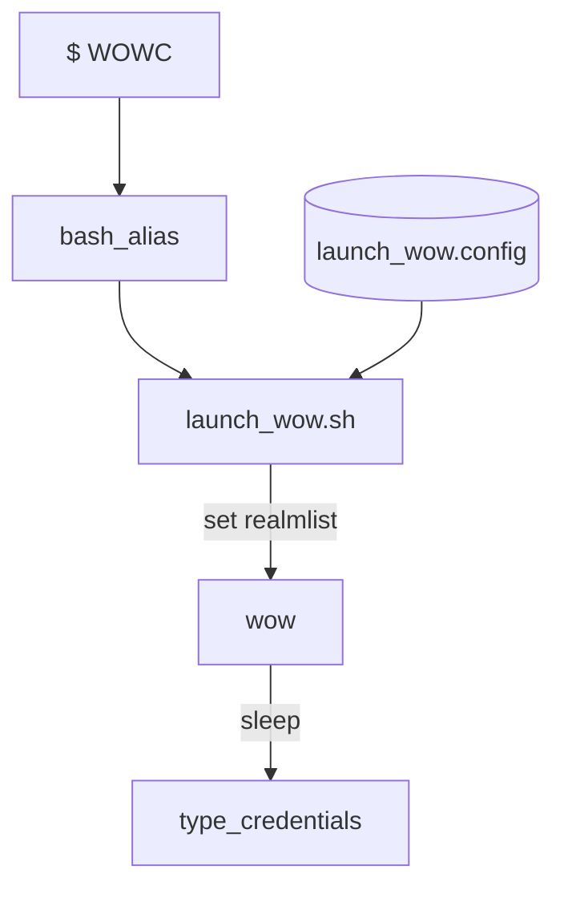

<!-- PROJECT LOGO -->
<br />
<div align="center">
  <a href="https://github.com/SoglaHash/wow-autologin">
    
  </a>

  <h3 align="center">Autologin WoW lutris/wine</h3>
</div>

# Autologin WoW lutris/wine
This project allows to set aliases in `.bash_aliases` to load a config and
launch the chosen version of wow, set realmlist and auto-login



![GUI Screenshot][gui-screenshot]

## Requirements
A version of WoW installed and able to run a launch command with wine/lutris/..

## Warning
This script does `NOT` send keystrokes to a specific `WoW.exe` window. It types
the credentials as you would on a keyboard with `xdotool` after a set delay to
the window with focus.

## Setup
Find game ID (`${ID}`) with
 ```
 lutris -l
 ```

`launch_wow.sh`
Change `GAME`, `LAUNCH_GAME` and `sleep` timers as needed
```
GAME="/media/${USER}/Data/games/${FOLDER}"
LAUNCH_GAME="env LUTRIS_SKIP_INIT=1 lutris lutris:rungameid/${ID}"
```

`launch_wow.config`
```
Henhouse <-- String to reference in .bash_aliases
set realmlist pvp.henhou.se
myusername
mypassword
```

`$ cat .bash_aliases`
```
alias WOWH="export ID=3; export FOLDER=wow112;/home/${USER}/scripts/launch_wow.sh Henhouse"
```

## Usage
Open shell and type an alias
```
$ WOWH
```
then keep focus and wait for autologin

[gui-screenshot]: ./screenshot.png