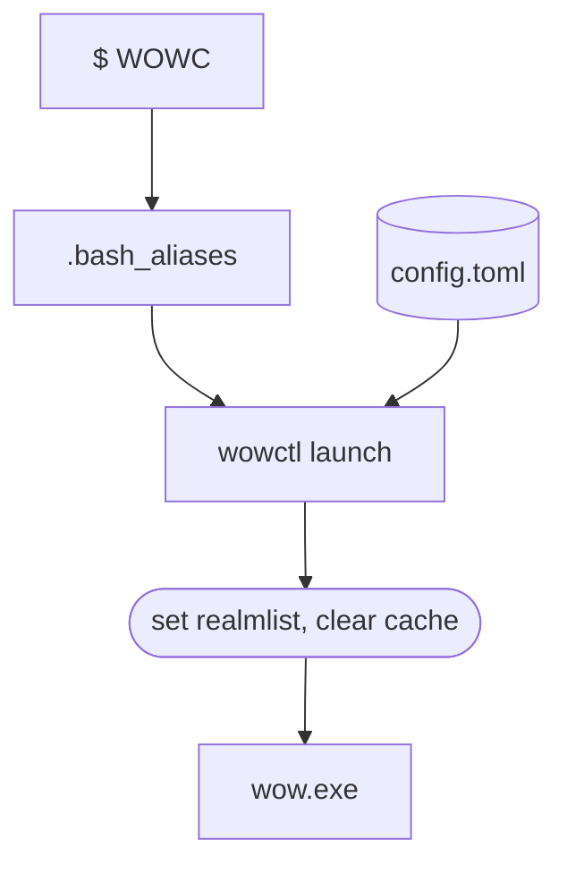
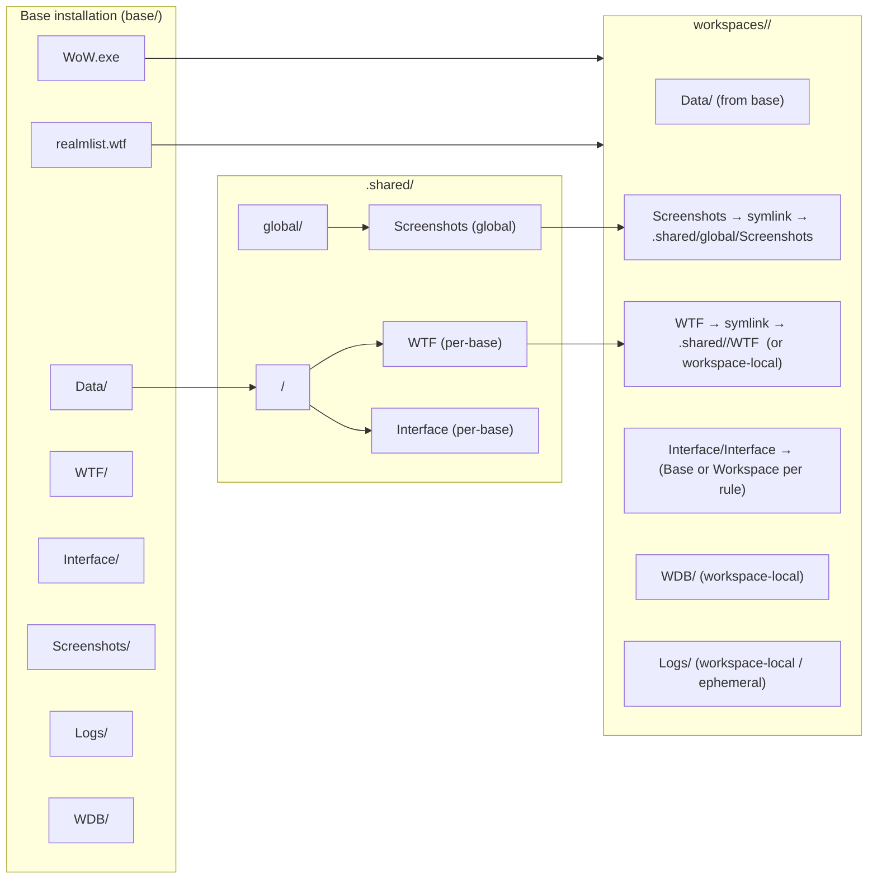

# Wow realm switch utility
This project allows to set aliases in (`.bash_aliases`, `.zsh_aliases`, ...) to load a config and launch the chosen version of wow, set realmlist and auto-login.



**New in 0.3.0**: Support for shared base installations with workspaces. Create multiple lightweight WoW configurations from a single 17GB base client.



```zsh
.
├── .shared
│   ├── chromie-3.3.5a
│   │   └── WTF
│   ├── global
│   │   └── Screenshots
│   └── vanilla-1.12
│        ├── Interface
│        └── WTF
├── wow112
│   ├── Data
│   ├── Interface -> /home/pc/Games/.shared/vanilla-1.12/Interface
│   ├── Screenshots -> /home/pc/Games/.shared/global/Screenshots
│   ├── WoW.exe
│   └── WTF -> /home/pc/Games/.shared/vanilla-1.12/WTF
├── wow335-chromiecraft
│   ├── Data
│   ├── Screenshots -> /home/pc/Games/.shared/global/Screenshots
│   ├── Wow.exe
│   └── WTF -> /home/pc/Games/.shared/chromie-3.3.5a/WTF
├── wow335-custom
│   ├── Data
│   ├── Screenshots -> /home/pc/Games/.shared/global/Screenshots
│   ├── Wow.exe
│   └── WTF -> /home/pc/Games/.shared/chromie-3.3.5a/WTF
├── wow335-stock
│   ├── Data
│   ├── Screenshots -> /home/pc/Games/.shared/global/Screenshots
│   ├── Wow.exe
│   └── WTF -> /home/pc/Games/.shared/chromie-3.3.5a/WTF
└── wow-base
    ├── wow112-base
    └── wow335-base
```


## Usage

### Commands

```zsh
Usage: wowctl <COMMAND>

Commands:
  launch     Launch a WoW workspace
  init-base  Initialize a base WoW installation for workspace creation
  create     Create a new workspace from a base installation
  clean      Clean ephemeral files (cache, logs) from a workspace
  help       Print this message or the help of the given subcommand(s)

Options:
  -h, --help     Print help
  -V, --version  Print version

```

### Workspace Management

Create workspaces from a shared base to avoid duplicating 17GB clients:

```bash
# 1. Initialize a base installation (one-time setup)
wowctl init-base ~/Games/WoW/Base335a --profile chromie-3.3.5a

# 2. Create workspaces from the base
wowctl create stock-ac --base ~/Games/WoW/Base335a
wowctl create chromie --base ~/Games/WoW/Base335a

# 3. Launch a workspace
wowctl launch Chromie

# 4. Clean workspace cache/logs
wowctl clean Chromie
```

```
$ WOWC
Loading configuration for:
        chromiecraft
Realmlist set to:
        set realmlist logon.chromiecraft.com
Accounts:
        1. aaaaaaa / cccc
        2. bbbbb   / dddd
Launching with command:
        lutris lutris:rungameid/1
```

## Setup

### Basic Setup

3 files are required:

1. alias config (`.bash_aliases`, `.zsh_aliases`, ...)
2. a `wowctl` binary
3. configuration file `config.toml`.

### Example `config.toml`

```toml
[Local]
directory = "~/Games/wow335"
realmlist_rel_path = "Data/enUS/realmlist.wtf"
executable = "Wow.exe" # optional, defaults to "Wow.exe"
launch_cmd = "lutris lutris:rungameid/1" # optional, defaults to wine with prefix in directory/.wine or executable on windows
arguments = '-login "account" -password "password" -realmlist "logon.chromiecraft.com"' # optional
realmlist = "127.0.0.1" # expands to `set realmlist 127.0.0.1`
clear_cache = true # optional, removes .Cache folder
account = "account" # optional, prints to console
password = "password" # optional, prints to console and writes to clipboard (experimental)
# Multiple accounts as a dictionary (account = password)
accounts.main = "password1"
accounts.alt = "password2"
```

### Workspace-Based Setup (New in 0.3.0)

⚠️ Currently, only 335 and 112 clients are supported.

For users who want to manage multiple WoW configurations with different patches/addons while sharing the base game files (17GB):


#### Step 1: Initialize a Base Installation


```bash
wowctl init-base ~/Games/WoW/Base335a --profile chromie-3.3.5a
```

This will:
- Scan your existing WoW directory
- Verify all required files are present
- Classify files by role (BaseData, MutableData, UserConfig, etc.)
- Compute checksums for immutable files
- Create a `manifest.toml` in the base directory

**Base Structure:**
- `Wow.exe` → Executable (linked to workspaces)
- `Data/common*.MPQ` → BaseData (immutable, hard-linked)
- `Data/patch*.MPQ` → MutableData (copied to each workspace)
- `Screenshots/` → UserMedia (can be shared or per-workspace)
- `WTF/` → UserConfig (typically per-workspace)
- `Cache/`, `Logs/` → Ephemeral (created fresh in each workspace)

#### Step 2: Create Workspaces

```bash
# Create a stock AzerothCore workspace
wowctl create stock-ac --base ~/Games/WoW/Base335a

# Create a Chromie workspace with custom patches
wowctl create chromie --base ~/Games/WoW/Base335a

# Custom sharing rules
wowctl create test-realm \
  --base ~/Games/WoW/Base335a \
  --share screenshots=global \
  --share interface=base \
  --share wtf=workspace
```

**Default Sharing Strategies:**
- `screenshots=global` - All workspaces share screenshots
- `interface=base` - Workspaces from the same base share addons
- `wtf=workspace` - Each workspace has its own WTF config

**Sharing Options:**
- `global` - Shared across ALL workspaces
- `base` - Shared among workspaces created from the same base
- `workspace` - Unique to each workspace

#### Step 3: Configure config.toml

Point your configurations to the workspace directories:

```toml
[StockAC-Realm1]
directory = "~/.local/share/wow_workspaces/stock-ac"
realmlist = "realm1.azerothcore.org"
realmlist_rel_path = "Data/enUS/realmlist.wtf"
launch_cmd = "lutris lutris:rungameid/1"

[StockAC-Realm2]
directory = "~/.local/share/wow_workspaces/stock-ac"
realmlist = "realm2.azerothcore.org"
realmlist_rel_path = "Data/enUS/realmlist.wtf"
launch_cmd = "lutris lutris:rungameid/1"

[Chromie]
directory = "~/.local/share/wow_workspaces/chromie"
realmlist = "logon.chromiecraft.com"
realmlist_rel_path = "Data/enUS/realmlist.wtf"
launch_cmd = "lutris lutris:rungameid/1"
arguments = '-login "myaccount" -password "mypass"'
```

### Separation of responsibilities

Workspace lifecycle (initialization, creation, sharing configuration, and cleanup) is managed exclusively by the `wowctl` CLI. The `config.toml` file is intentionally simple: it is only for *launch targets* and should point to an existing directory (either a standalone installation or a workspace directory created with `wowctl create`). Do **not** put workspace creation or sharing rules in `config.toml` — those belong to the workspace metadata managed by `wowctl`.

Each workspace created by `wowctl create` stores its metadata in `workspace.toml` inside the workspace directory. Example `workspace.toml` (do not edit manually):

```toml
profile = "chromie-3.3.5a"
base = "/home/user/Games/WoW/Original"
created_at = "2025-12-18T12:34:56Z"

[sharing]
screenshots = "global"
addons = "base"
wtf = "workspace"
```

**Benefits:**
- Single 17GB base → Multiple lightweight workspaces
- Each workspace can have different custom patches in `Data/`
- Different addons/WTF configurations per workspace
- Same base files are hard-linked (no duplication)
- Switch realms using the same workspace by changing realmlist

### Example alias setup

```sh
wow_vs() {
    "$HOME/.local/bin/wowctl" "$@"
}
alias WOWC='wow_vs launch Chromiecraft'
alias WOWL='wow_vs launch Local'
alias WOWAC1='wow_vs launch AC-Realm1'
alias WOWAC2='wow_vs launch AC-Realm2'
```

### Auto-login

requires: [AwesomeWotlk](https://github.com/NoM0Re/awesome_wotlk), which provides support for auto-login and other enhancements.

The `wowctl` supports auto-login through the `arguments` field in the `config.toml` file. These arguments allow you to pass login credentials and realmlist settings directly to the game executable.

Example configuration:
```toml
arguments = '-login "account_name" -password "your_password" -realmlist "logon.chromiecraft.com"'
```

If you are using Lutris, instead of setting `arguments` in the `config.toml` file, you can configure them directly in Lutris:
1. Open the game in Lutris.
2. Navigate to `Game Options`.
3. Set the desired arguments under the `Arguments` field.

## Architecture

### File Role Classification

The tool classifies WoW client files into different roles:

| Role | Description | Workspace Handling | Examples |
|------|-------------|-------------------|----------|
| **Executable** | Main game binary | Hard-linked from base | `Wow.exe` |
| **BaseData** | Immutable game data | Hard-linked from base | `Data/common*.MPQ`, `Data/lichking.MPQ` |
| **MutableData** | Custom patches/data | Copied to workspace | `Data/patch-4.MPQ`, custom MPQs |
| **UserConfig** | User settings/addons | Per workspace (default) | `WTF/`, `Interface/` |
| **UserMedia** | Screenshots/videos | Shared (default) | `Screenshots/` |
| **Ephemeral** | Temporary files | Created fresh | `Cache/`, `Logs/`, `Errors/` |

### How It Works

1. **Base Installation**: The original WoW client (~17GB) is scanned and catalogued
2. **Manifest**: A `manifest.toml` tracks file roles and checksums
3. **Workspaces**: Lightweight directories that reference the base:
   - Immutable files (MPQs, exe) are hard-linked (no extra disk space)
   - Mutable files (custom patches) are copied
   - Config files follow sharing rules (symlinked or unique)
4. **Launch**: Use existing `config.toml` to point to workspace directories
   - Tool modifies `realmlist.wtf` before launch
   - Supports multiple realms using the same workspace

### Example Scenario

**Problem**: You want to play on 3 different realms:
- AzerothCore (stock 3.3.5a)
- AzerothCore Custom (custom patches)
- Chromiecraft (HD client patches)

**Traditional Solution**: 3 separate 17GB installations = 51GB

**Workspace Solution**:
- 1 base (17GB)
- 1 stock-ac workspace (few MB for WTF/Cache)
- 1 chromie workspace (few MB + custom patches)
- Total: ~18-20GB depending on custom patches

**config.toml**:
```toml
[AC-Realm1]
directory = "~/.local/share/wow_workspaces/stock-ac"
realmlist = "realm1.ac.org"
# ... other settings

[AC-Realm2]
directory = "~/.local/share/wow_workspaces/stock-ac"
realmlist = "realm2.ac.org"
# ... other settings

[Chromie]
directory = "~/.local/share/wow_workspaces/chromie"
realmlist = "logon.chromiecraft.com"
# ... other settings
```

Launch with: `WOWAC1`, `WOWAC2`, `WOWC` (using your aliases)

### Building the binary

```sh
cd wowctl
cargo build --release
```

The binary will be at `target/release/wowctl`

## Contributing

Contributions are welcome! Areas for improvement:
- Additional WoW version profiles (TBC, ...)
- GUI for workspace management
- Cross-platform testing (especially Windows)