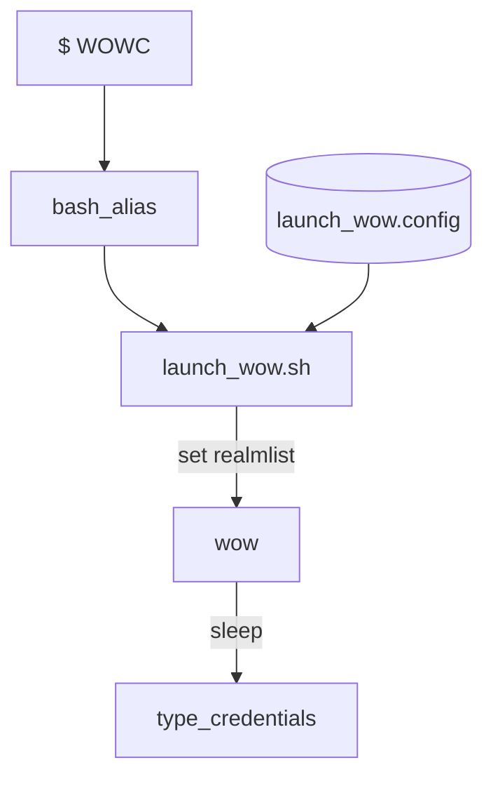

# Bash realm switcher and autologin
This project allows to set aliases in `.bash_aliases` to load a config and
launch the chosen version of wow, set realmlist and auto-login



## Warning
⚠️ If autologin is enabled, this script does `NOT` send keystrokes to a specific `WoW.exe` window. It types
the credentials as you would on a keyboard with `xdotool` after a set delay to
the window with focus.

## Setup
3 files need to be setup: `.bash_alias`, a `launch_wow.sh` script and `launch_wow.config`.

Adding or removing a server requires setting up a new alias to `.bash_alias` and adding the configuration to `launch_wow.config`.

### `launch_wow.config`
Each line respectively contains: description, game_folder, realmlist_rel_path, launch_cmd, realmlist, username, passwd

```
Local <-- string to reference in launch_wow.sh
/media/jelle/Data/games/wow335 <-- game folder containing WoW.exe
Data/enUS/realmlist.wtf  <-- relative path to game folder
env LUTRIS_SKIP_INIT=1 lutris lutris:rungameid/2
set realmlist 127.0.0.1
myusername
mypassword
```

`env LUTRIS_SKIP_INIT=1 lutris lutris:rungameid/2` may be replaced with `wine wow.exe`

Find game ID (for `rungameid/2`) with
 ```
 lutris -l
 ```

### `.bash_aliases`
Set a 2nd argument to skip writing realmlist. `.launch_wow.config` must contain a line for
```
alias WOWL="${HOME}/scripts/launch_wow.sh Local"
alias WOWM="${HOME}/scripts/launch_wow.sh Mistblade skip_write_realmlist"
```

### `launch_wow.sh`
Change `sleep` timers as needed

## Usage
Open shell and type an alias
```
$ WOWL
```
then keep focus and wait for autologin