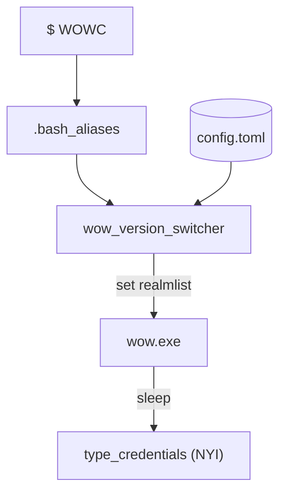

# Wow realm switch utility
This project allows to set aliases in (`.bash_aliases`, `.zsh_aliases`, ...) to load a config and launch the chosen version of wow, set realmlist and ~~auto-login~~ (NYI)



## Usage

```
Usage: wow_version_switcher [OPTIONS] <GAME>

Arguments:
  <GAME>  Which game key to launch (as in your config file)

Options:
      --config <CONFIG>  Path to your config.toml [default: ~/.config/wow_version_switcher/config.toml]
  -h, --help             Print help
```

```
$ WOWC
Loading configuration for:
        chromiecraft
Realmlist set to:
        set realmlist to logon.chromiecraft.com
Accounts:
        1. aaaaaaa / cccc
        2. bbbbb   / dddd
Launching with command:
        lutris lutris:rungameid/1
```

## Setup
3 files are required:

1. alias config (`.bash_aliases`, `.zsh_aliases`, ...)
2. a `wow_version_switcher` binary
3. configuration file `config.toml`.

### Example `config.toml`

```toml
[Local]
directory = "~/Games/wow335"
realmlist_rel_path = "Data/enUS/realmlist.wtf"
executable = "Wow.exe" # optional, defaults to "Wow.exe"
launch_cmd = "lutris lutris:rungameid/1" # optional, defaults to wine with prefix in directory/.wine or executable on windows
realmlist = "127.0.0.1" # expands to `set realmlist 127.0.0.1`
clear_cache = true # optional, removes .Cache folder
account = "account" # optional, prints to console
password = "password" # optional, prints to console and writes to clipboard (experimental)
# Multiple accounts as a dictionary (account = password)
accounts.main = "password1"
accounts.alt = "password2"
```

### Example alias setup

```sh
wow_vs() {
    "$HOME/.local/bin/wow_version_switcher" "--config" "~/.config/wow_version_switcher/config.toml" "$@"
}
alias WOWC='wow_vs Chromiecraft'
alias WOWL='wow_vs Local'
```

### Building the binary

```sh
cargo build --release
```
